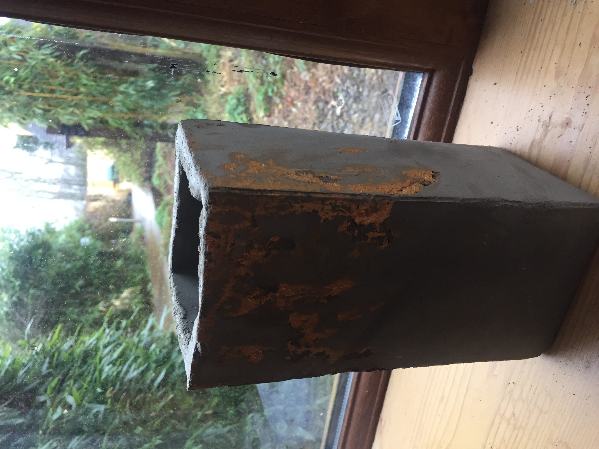

<html>
	<h2>Curriculum Vitae</h2>
						

							<article class="col-6 col-12-xsmall work-item">
								<embed src="files/Ciarán Dervan CV.pdf" type="application/pdf" width="120%" height="2000px" scrollbar=1/>
								
							</article>
             
	

		 <h2> Proficiencies </h2>
							<h3> Statistics and Analytics </h3>
						
						

							

								
	                                                

							 

								
	                                                

							 

								
	                                                

							 

								
	                                                

							 

								
	                                                

		
 <body>
									<a href="https://ciarandervan.github.io"><h3 style="color:rgb(13, 192, 168)">Back to Home</h3></a>
								 </body>

