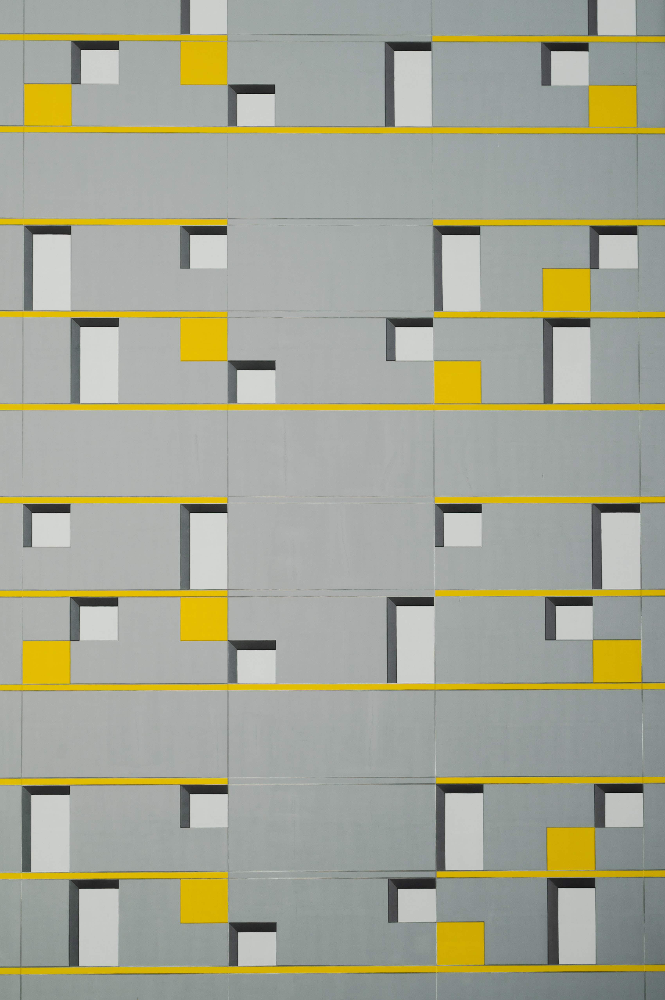

<html>
	
	<!-- Main -->
			

				<!-- One -->
					<section id="one">
						<header class="major">
							<h2 style="color:rgb(95,158,160)">Some examples of the softwares I can use and projects I've done using them. </h2>
						</header>

				<!-- Two -->
					<section id="two">
						

							<article class="col-6 col-12-xsmall work-item">
								</a>
								<body>
									<a href="https://ciarandervan.github.io/cv"><h3 style="color:rgb(95,158,160)">CURRICULUM VITAE</h3></a>
								 </body>
							
<em>My current CV.</em>

							</article>
							<article class="col-6 col-12-xsmall work-item">
								</a>
								<body>
									<a href="https://ciarandervan.github.io/data"><h3 style="color:rgb(95,158,160)">DATA ANALYTICS AND VISUALIZATION</h3></a>
								</body>
						        
<em>A showcase of what I can do.</em>

							</article>
							<article class="col-6 col-12-xsmall work-item">
								</a>
								<body>
									<a href="https://ciarandervan.github.io/certs"><h3 style="color:rgb(95,158,160)">CERTIFICATES</h3></a>
								</body>
								
<em>Certificates I have received from online courses.</em>

							</article>
							<article class="col-6 col-12-xsmall work-item">
								</a>
								<body>
									<a href="https://ciarandervan.github.io/ma"><h3 style="color:rgb(95,158,160)">MA THESIS AND TRANSCRIPT</h3></a>
								</body>
				
<em>My Master's thesis and transcripts from my postgrad.</em>

							</article>
							<article class="col-6 col-12-xsmall work-item">
								</a>
								<body>
									<a href="https://ciarandervan.github.io/ba"><h3 style="color:rgb(95,158,160)">BA THESIS AND TRANSCRIPT</h3></a>
								</body>

<em>My Bachelor's dissertation and transcripts from my undergrad.</em>

							</article>
							<article class="col-6 col-12-xsmall work-item">
								</a>
								<body>
									<a href="https://ciarandervan.github.io/pastimes"><h3 style="color:rgb(95,158,160)">PASTIMES</h3></a>
								</body>

<em>A collection of some of the pieces I've made.</em>

							</article>
						

					</section>
