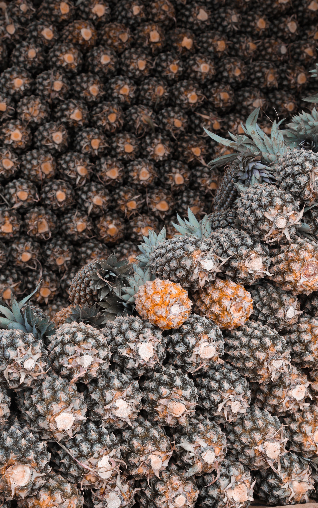

layout: page
title: "Data Analytics and Visualization"
permalink: /data/

<html>
	<head>
		<title>Data Analytics and Visualization</title>
		<meta charset="utf-8" />
		<meta name="viewport" content="width=device-width, initial-scale=1, user-scalable=no" />
		<link rel="stylesheet" href="assets/css/main.css" />
	</head>
	<body class="is-preload">

		<!-- Header -->
			<header id="header">
				

					<h1>
<strong>Hi, I'm Ciarán.  
					Welcome to my portfolio website!

				 
				

	<h2>
Get In Touch
</h2>
	Click the icon below to visit my Linkedin or send me an Email.
	<ul class="labeled-icons">
	<ul class="icons">
	<li><a href="https://www.linkedin.com/in/ciar%C3%A1n-dervan-68356316a/" class="icon brands fa-linkedin">Linkedin</a></li>
	<li><a href="mailto:ciarandervan@gmail.com" class="icon solid fa-envelope">Email</a></li>
	</ul>
	<h3Email:</h3>
	<a href="#">ciarandervan@gmail.com</a>
				

			</header>

		<!-- Main -->
			

				<!-- One -->
					<section id="one">
						<header class="major">
							<h2>Thank you for visiting for visiting my website.</h2>
						</header>
						
My name is Ciarán Dervan, I am a Psychology (BA) and Conciousness and Embodiment (MA) graduate, with a keen interest in research and data analytics. In the sections below, you will find a showcase of my experience, skills, projects and pastimes.
						

					

				<!-- Two -->
					<section id="two">
						<h2>Recent Work</h2>
						

							<article class="col-6 col-12-xsmall work-item">
								</a>
								<body>
									<a href="https://ciarandervan.github.io/cv"><h3 style="color:rgb(13, 192, 168)">Curriculum Vitae</h3></a>
								 </body>
								
My current CV.

							</article>
							<article class="col-6 col-12-xsmall work-item">
								</a>
								<body>
									<a href="https://ciarandervan.github.io/data"><h3 style="color:rgb(13, 192, 168)">Data Analytics and Visualization</h3></a>
								</body>
								
A showcase of what I can do.

							</article>
							<article class="col-6 col-12-xsmall work-item">
								</a>
								<body>
									<a href="https://ciarandervan.github.io/certs"><h3 style="color:rgb(13, 192, 168)">Certificates</h3></a>
								</body>
								
Certificates I have received from online courses.

							</article>
							<article class="col-6 col-12-xsmall work-item">
								</a>
								<body>
									<a href="https://ciarandervan.github.io/ma"><h3 style="color:rgb(13, 192, 168)">MA Thesis and Transcript</h3></a>
								</body>
								
My Master's thesis and transcripts from my postgrad.

							</article>
							<article class="col-6 col-12-xsmall work-item">
								</a>
								<body>
									<a href="https://ciarandervan.github.io/ba"><h3 style="color:rgb(13, 192, 168)">BA Thesis and Transcript</h3></a>
								</body>
								
My Bachelor's dissertation and transcripts from my undergrad.

							</article>
							<article class="col-6 col-12-xsmall work-item">
								</a>
								<body>
									<a href="https://ciarandervan.github.io/pastimes"><h3 style="color:rgb(13, 192, 168)">Pastimes</h3></a>
								</body>
								
A collection of some of the pieces I've made in my spare time for fun.

							</article>
						

					</section>

			
