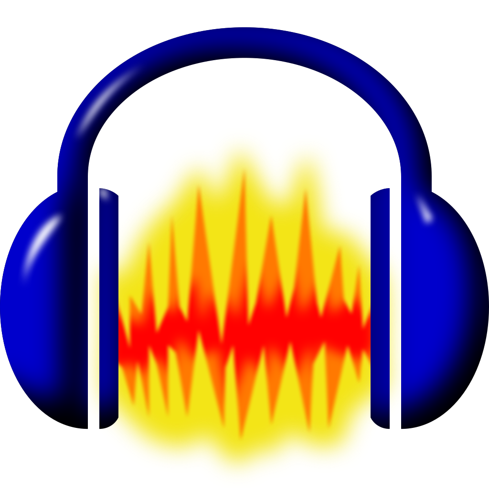

<html>	
	<h2> I enjoy making and editing Music, Videos and Multi-media art. Below is a list of the products I use to make things.</h2> 
	

 
		 <h2> Proficiencies </h2>
	
	

							

								
								
 Adobe Photoshop 

	                                                

							 

								
								 
 Adobe After Effects 

	                                                

							 

								
								 
 Adobe Premiere Pro 

	                                                

							 

								
								 
 Audacity 

							

							 

								
								 
 Blender 
 
						         

								 

								
								 
 GIMP 

								 

