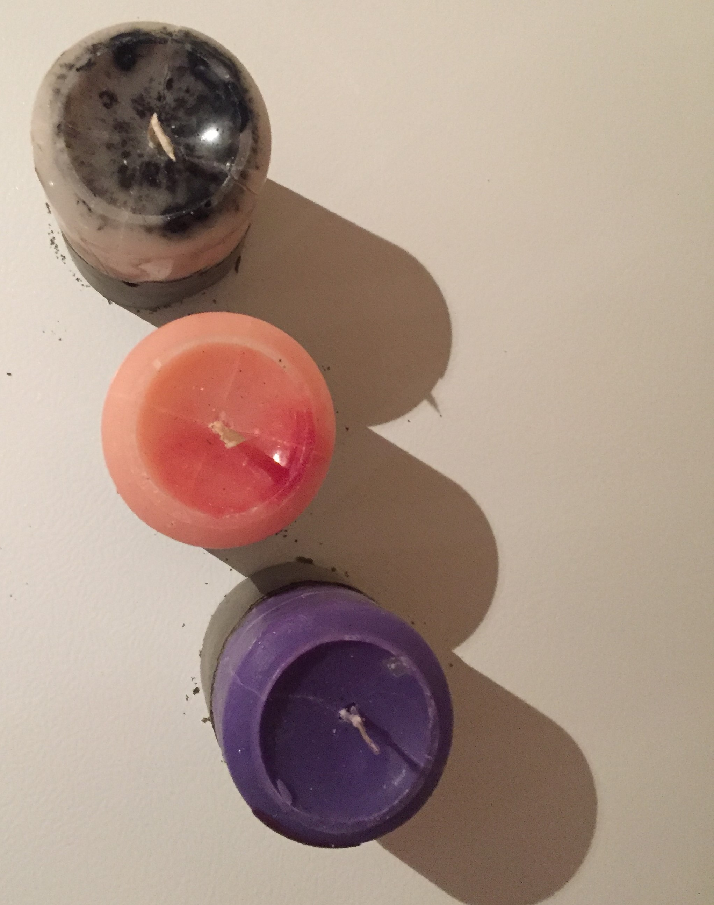

<html>
	<h1> Just a few of the things I enjoy making </h1>

							
							

								
	                                                

							 

								
	                                                

							 

								
	                                                

							 

								
	                                                

							 

								
	                                                

	                                                

								
	                                                

							 

								
	                                                

							 

								
	                                                

							 

								
	                                                

							 

								
	                                                

	                                                

								
	                                                

							 

								
	                                                

							
 <body>
									<a href="https://ciarandervan.github.io"><h3 style="color:rgb(13, 192, 168)">Back to Home</h3></a>
								 </body>
							
